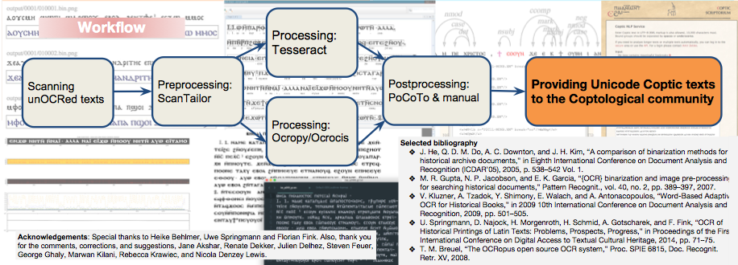

# CopticOCR

## Developers
### Göttingen
- So Miyagawa
- Kirill Bulert
- Marco Büchler

### Berlin
- Eliese-Sophia Lincke

## Coptic
- The final stage of the Ancient Egyptian language used in Egypt from ca. the third century 
- A new writing system based on the Greek alphabet and several letters from Demotic (a language stage and writing system used in Egypt from ~ 700 BCE)
-  A language transmitted in several regional forms (dialects) with a large production of manuscripts in Sahidic Coptic, the dialect at the basis of our OCR work

## Coptic alphabet
- Ca. 30 letters.
- Several diacritics such as tremas, circumflexes, supralinear strokes etc. 
- Several punctuation marks such as dots, commas, and colons  
- Editorial marks in editions

## Why is Coptic OCR needed?

- OCR for Coptic is not well-developed.
- Almost all the Coptic texts in past publications were not OCRed. 
 -   OCR for Coptic is needed by many DH projects in Coptic.
 -   There is a small amount of human power in Coptology compared with the large amount of unOCRed Coptic editions.

## Coptic DH projects (selected)
 -   SFB 1136 (Göttingen) 
 	 -   Creates a text corpus of selected monastic works in Coptic 
 -   Digital Edition of the Coptic Old Testament (Göttingen) 
 	 -   Creates a digital edition of the Coptic translation of the Old Testament 
 -   Coptic SCRIPTORIUM (Georgetown/Pacific) 
 	 -   Creates a linguistically annotated Coptic corpus

## Existing Coptic OCR
 -   Tesseract (developed by Ray Smith), for Coptic, trained by Moheb Mekhaiel (http://www.moheb.de/ocr.html)

## New method: Ocropy
 -   Python-based OCR package 
 -   Using recurrent neural networks 
 -   Originally developed by Thomas Breuel 
 -   Available at https://github.com/tmbdev/ocropy 
 -   Trained for Coptic by our group and our collaborator Eliese-Sophia Lincke (Berlin)

